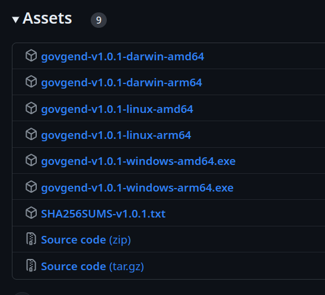

# Submitting a Text Proposal to GovGen - and How to Submit Transactions Securely

This guide illustrates the best practices for signing and broadcasting
transactions to GovGen, but the general concept is applicable more broadly to
almost any blockchain, and commands on other [Cosmos
SDK](https://github.com/cosmos/cosmos-sdk) chains will be very similar if not
identical. It will show in particular how to submit a governance text proposal
using the Command Line Interface (CLI), but the process applies in general to
any transaction. We will also briefly explore this at the end of the guide.

The guide presumes that your **account data** is stored on an **offline
computer** (but not the private key if you are using a hardware wallet as we
recommend everyone to do). This offline machine is used to **create** (although
you can use any computer for this) and **sign** a transaction. Following this,
a **separate online computer** is used to **broadcast** the signed transaction.
The whole process will make use of the GovGen CLI available with the [GovGen
chain software](https://github.com/atomone-hub/govgen).

Performing the signing of transactions on an offline computer is the safest way
to limit the efficacy of potential malware, viruses, or malicious software,
thus protecting your account. Even if the computer were to be compromised for
any reason, it would be unable to send data to a potential attacker.

> [!NOTE]
> An offline computer refers to a machine that is *never* connected to the
> internet. Therefore, a machine that is intermittently connected is **NOT**
> considered an offline computer.

> [!IMPORTANT]
> If you find any security issue/concern in this document, please send an email
> to security@allinbits.com.

## Prerequisites

### 1. Download the `govgend` binary

- Go to https://github.com/atomone-hub/govgen/releases/tag/v1.0.1 (or the
  [latest available release](https://github.com/atomone-hub/govgen/releases)
  used by the GovGen chain)



- Download the binary that corresponds to your OS
- Download the file `SHA256SUMS-v1.0.1.txt`
- Make sure that the `sha256sum` of the binary you have downloaded matches the
  `sha1sum` listed in that file. From a terminal window type:

```bash
sha256sum -c --ignore-missing SHA256SUMS-v1.0.1.txt 
```

```bash
govgend-v1.0.1-linux-amd64: OK
```

- Safely copy the binary into your **offline** and **online computers**, to a
  directory present inside your `$PATH` environment variable (like
  `$GOPATH/bin`, `usr/bin` or `/usr/local/bin`), to make it accessible for
  execution. Alternatively, you can bypass this step and run `govgend` using
  its full path. In the following code snippets, use `./path/to/govgend`
  instead of just `govgend`.

### 1.a. Build the `govgend` binary [alternative]

Alternatively, you can also build the `govgend` binary by cloning the
repository and doing `make install` on both the **offline** and **online
computers**. Note that you will have to manually copy the cloned repository on
the offline computer as obviously it won't be able to access the remote
resource, or more easily copy over the built binary if you wish to do so
alternatively (you can know its location on the online computer typing `which
govgend`):

```bash
git clone --branch v1.0.1 --depth 1 https://github.com/atomone-hub/govgen.git
cd govgen && make install
```

To build `govgend`, you will require **Go 1.20** specifically. If you have a
newer version, which is likely, you can use the following procedure to build
`govgend` without changing your current Go installation:

```bash
go install golang.org/dl/go1.20.14@latest
go1.20.14 download
cd /path/to/govgen
GOROOT=$(go1.20.14 env GOROOT) PATH=$GOROOT/bin:$PATH make install
```

After the command has been executed, verify your binary and ensure it produces
the following output (for version v1.0.1):

```bash
govgend version --long
```

```bash
name: govgen
server_name: govgend
version: main-023ed8235a82e68079b2a61c2fa1be3f06cf7a6b
commit: 023ed8235a82e68079b2a61c2fa1be3f06cf7a6b
build_tags: netgo,ledger
go: go version go1.20.14 linux/amd64
```

> [!WARNING]
> If you use `go install ./cmd/govgend` or any other method besides `make
> install` to build the binary, this will likely result in dropped features
> such as Ledger support, which is probably not what you want.

### 2. Add your Ledger account to `govgend`’s keyring

This section must be completed from the **offline computer**.

Connect your Ledger hardware wallet to your computer and open the **Cosmos** app.

Then type in your terminal:

```bash
govgend keys add <ACCT_NAME> --ledger
```

replacing `<ACCT_NAME>` with the name you would like to give to the account in
the `govgend` keyring. You will need to confirm the operation on your Ledger
device to allow `govgend` to read your *public key*.

Should you need to access more options like a different HD derivation path (for
example available as `--hd-path <custom-path>`) you can access the whole list
of options by typing in the command line:

```bash
govgend keys add -h
```

### 2.a. Import your private key from `gaiad`'s keyring [alternative] [NOT RECOMMENDED]

This section must be completed from the **offline computer**.

The section assumes that your private key is already stored in the `gaiad`'s
keyring. It provides details on how to import it into the `govgend`'s keyring.

> [!WARNING]
> We do not advise this method, and recommend extreme care because it will
> briefly make your private key readable to your operating system while you are
> copying it.  **We always recommend using an hardware wallet instead.** Please
> refer to the dedicated section for instructions on how to add your Ledger
> account to `govgend`’s keyring.

> [!NOTE]
> Using your mnemonic phrase with `govgend keys add <ACCT_NAME> --recover` is
> also a potential way of adding your account to `govgend`'s keyring. However
> be very careful as this is **heavily discouraged** as a method, since it will
> lead you to manually typing your mnemonic which is **potentially vulnerable**
> to being sniffed!

First, you need to export your private key from Gaia. Run the following
command, with `ACCT_NAME` as the name of your account:

```bash
gaiad keys export <ACCT_NAME> 2>&1 | tee key.info
```

Now you can import it in `govgend`'s keyring:

```bash
govgend keys import <ACCT_NAME> key.info
```

We recommend immediately deleting that file once the import is complete:

```bash
file=</path/to/your/key.info> && size=$(cat "$file" | wc -c) && \
   dd if=/dev/zero of="$file" bs=$size count=1 && \
   truncate -s 0 "$file" && rm "$file"
```

The command above will also take care of more deeply removing the file from the
file system, for added security. Be sure to replace the
`</path/to/your/key.info>` with the actual path to the `key.info` file you
created previously.

## Submitting a Transaction

### 1. Get account address [offline computer]

From the **offline computer**, where your account data is stored, run the
following command, replacing `<ACCT_NAME>` with the name of your account:

```bash
govgend keys show <ACCT_NAME>
```

```bash
- name: <ACCT_NAME>
  type: local
  address: govgen12anjnnyqr7c0pdgvwmdcwe0r8xx8l0n4kwk2n6
  pubkey: '{"@type":"/cosmos.crypto.secp256k1.PubKey","key":"Ak37cwyDsAcvaVsGbmff3r0Ks6UM+hfQdgYrpKZiFMeH"}'
  mnemonic: ""
```

Copy the `address` field and keep it handy. It will be used to identify you as
the author of the transaction. In the following sections of this guide, it will
be referred to as `ADDRESS`.

> [!TIP]
> If you don’t remember the name of your account, you can display all the keys
> by running `govgend keys list`.

### 2. Get account and sequence number [online computer]

This must be fetched from the **online computer**, because the information is
stored on the blockchain. Run the following command, replacing `<ADDRESS>` with
the address of your account as collected during step 2:

```bash
govgend query auth account <ADDRESS> --node https://rpc.govgen.io:443
```

```bash
'@type': /cosmos.auth.v1beta1.BaseAccount
account_number: "93767"
address: <ADDRESS>
pub_key:
  '@type': /cosmos.crypto.secp256k1.PubKey
  key: AoJlnNcdiaLoPQzAdl5jexafkQ/AKoLe5YG58fsYF4ZX
sequence: "3"
```

Copy the `account_number` and `sequence` field somewhere, they will be referred
to as `ACCOUNT_NUMER` and `SEQUENCE_NUMBER` in the following sections.

If you can’t find the address by querying the blockchain, it means the account
does not exist and hence its account sequence will be 0, and account number
will be unspecified. However, keep in mind that accounts that do not exist are
not able to submit transactions either on GovGen as well as in most other live
blockchains. Generally, you would be able to create a new account by adding to
it some balance. On GovGen however this will not be possible as tokens are not
transferable.

### 3. Create the transaction

You can create the transaction from either the **online** or the **offline
computers**, with the caveat that you will have to safely copy the unsigned
transaction over the offline computer for signing in case you used the online
computer to generate it. You can generate all types of transactions using the
CLI. The command is as follows:

```bash
govgend tx <MODULE> <TRANSACTION> [FLAGS]
   --from <ADDRESS> \
   --chain-id govgen-1 \
   --fees 5000ugovgen \
   --generate-only \
   --output-document tx.unsigned.json
```

Here, `MODULE` refers to the Cosmos SDK module name, and `TRANSACTION` is the
transaction name in kebab-case. To list all available transactions of a module,
use `govgend tx <MODULE>`. 

> [!TIP]
> You can get a list of all available modules by typing `govgend tx -h` in your
> terminal.

For instance, with the `gov` module, the following transactions are available:

```bash
govgend tx gov 
```

```bash
Governance transactions subcommands

Usage:
  govgend tx gov [flags]
  govgend tx gov [command]

Available Commands:
  deposit         Deposit tokens for an active proposal
  submit-proposal Submit a proposal along with an initial deposit
  vote            Vote for an active proposal, options: yes/no/no_with_veto/abstain
  weighted-vote   Vote for an active proposal, options: yes/no/no_with_veto/abstain

```

To specifically submit a proposal, run the following command:

```bash
govgend tx gov submit-proposal \
   --proposal <path/to/PROP.json> \
   --from <ADDRESS> \
   --chain-id govgen-1 \
   --fees 5000ugovgen \
   --generate-only \
   --output-document tx.unsigned.json
```

Here, `<path/to/PROP.json>` refers to the path to a JSON file that contains
your proposal. While it is possible to submit a proposal using only flags, we
recommend using a JSON file. Proposals can be lengthy, and it is harder to
identify errors during copy-pasting when placed inside flags.

The JSON file should look like the following:

```json
{
  "title": "Test Proposal",
  "description": "My awesome proposal",
  "type": "Text",
  "deposit": "50000000ugovgen"
}
```

Replace the `title` and `description` fields with your proposal content. The
`deposit` field must be set to at least 50 $GOVGEN because it is the currently
set minimum initial deposit, but you can increase this amount if desired. Note
that you won't be able to submit a proposal if your balance does not cover the
specified deposit and associated fees.

The command will generate a `tx.unsigned.json` file in the current directory,
which contains the necessary information to submit the proposal.  Please note
that you might be required to adjust the fees for your transaction to be
successfully accepted and included in a block.

### 4. Sign the transaction [offline computer]

From the **offline computer**, we will now sign the transaction, using the
`tx.unsigned.json` file generated at the previous step. Run the following
command:

```bash
govgend tx sign tx.unsigned.json \
   --offline \
   --from <ACCT_NAME> \
   --account-number <ACCOUNT_NUMBER> \
   --sequence <SEQUENCE_NUMBER> \
   --chain-id govgen-1 \
   --output-document tx.signed.json
```

This will generate a `tx.signed.json` file in the current directory, which
contains the final signed transaction. 

Remember to have the Ledger connected and the Cosmos app open before hitting
enter because the signing will have to be performed on the Ledger and you will
have to confirm the signing request on the device.

Notice that in case needed the `--ledger` flag can also be added to the above
command to force attempting connection to a Ledger device to request signature.
However, if you added the account to the keyring already using `--ledger`, this
flag for the `sign` command should not be necessary.

You can then securely transfer this file to the **online computer**. 

### 5. Broadcast the transaction [online computer]

From the **online computer**, run the following command:

```bash
govgend tx broadcast tx.signed.json --node https://rpc.govgen.io.443
```

```bash
code: 0
codespace: ""
data: ""
events: []
gas_used: "0"
gas_wanted: "0"
height: "0"
info: ""
logs: []
raw_log: '[]'
timestamp: ""
tx: null
txhash: D8681EFF99C0B93BA87972B57E18B3D6D3260C84C04E8BFC09877D7F19520833
```

If the `code` field is 0, then congratulations 🎉, your transaction has been
successfully accepted and is being gossiped by validators for potential
inclusion in the coming blocks. 

This means you should be able to see your transaction included in a block
shortly after. You should be able to view your proposal in the list by
executing the following command:

```bash
govgend query gov proposals --node https://rpc.govgen.io:443
```

You can also check your transaction status by running:

```bash
govgend query tx <TX_HASH>
```

Where `TX_HASH` comes from the `txhash` field returned by the `tx broadcast`
command just above.

Should the command return an error instead (for example insufficient fees), the
error should be self explanatory and help you understand what need to be fixed
in order to get your transaction to be successfully broadcasted and eventually
included in a block. If the error is instead caused by some state-dependent
check, you will have to check the blockchain for your `TX_HASH` to see what
went wrong as explained above.

## Conclusions

This guide demonstrated how to securely submit a governance text proposal to
GovGen using the CLI. However, its application isn't limited to this alone. It
can be used for all types of transactions and can also be employed as a general
guideline on how to submit transactions to virtually any Cosmos-SDK blockchain.

To submit another type of transaction, modify the command in Section 3. If
you're submitting to another Cosmos-SDK blockchain, simply switch to the
appropriate binary. 

As an example, here is the command that you would use to vote on a proposal
that is in the voting period, replacing `<PROPOSAL_ID>` and `<VOTE_OPTION>`
with the actual proposal ID (that you can obtain from the online computer
typing `govgend query gov proposals --node https://rpc.govgen.io:443`) and your
vote option between `yes` / `no` / `no_with_veto` / `abstain`:

```bash
govgend tx gov vote <PROPOSAL_ID> <VOTE_OPTION> \
   --from <ADDRESS> \
   --chain-id govgen-1 \
   --fees 5000ugovgen \
   --generate-only \
   --output-document tx.unsigned.json
```

While the [official Cosmos SDK
documentation](https://docs.cosmos.network/v0.46/run-node/txs.html) also
explains this, this guide addresses additional security concerns. Notably, it
covers issues related to private key management and transaction signing, adding
an additional layer of security by only performing the signing using an offline
computer.

